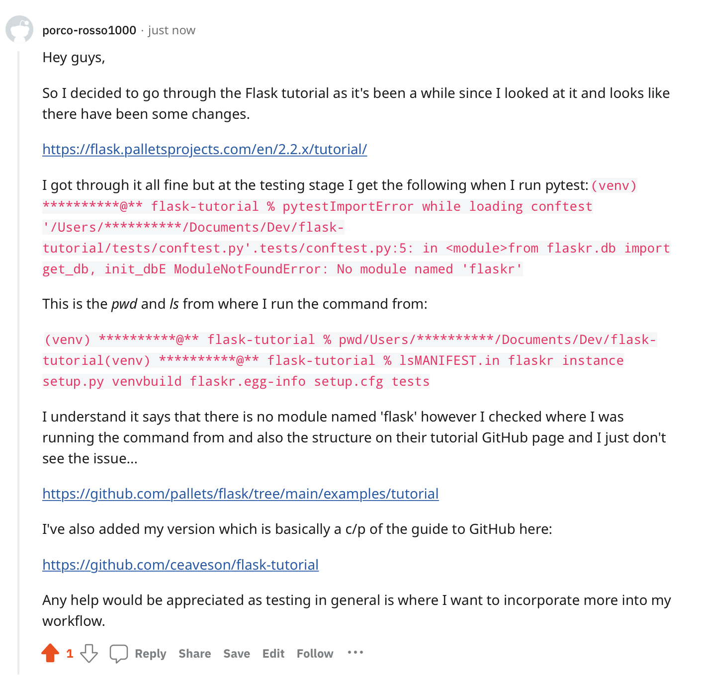

Day 2 and I decided to go through the [Flask Tutorial](https://flask.palletsprojects.com/en/2.2.x/tutorial/) as it has been a long while since I have last had a look through it and things seem to have changed. It was mostly reading and doing copy and pastes however I received errors when running tests. I added a post to Reddit r/learnpython to see if they could help me understand what's happening.
My code which as I said is pretty much copy and pastes is on Github [here](https://github.com/ceaveson/flask-tutorial)

